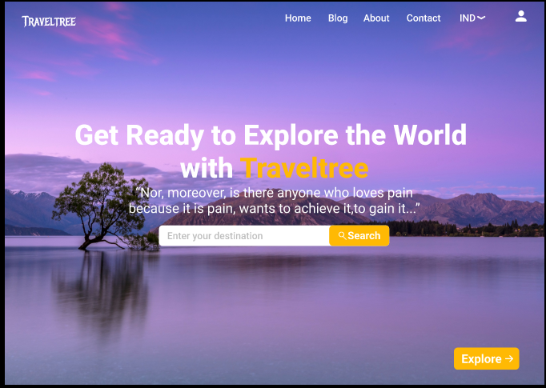
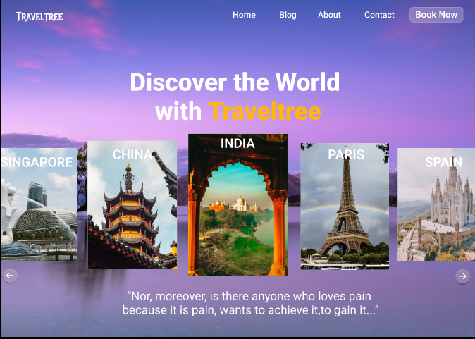
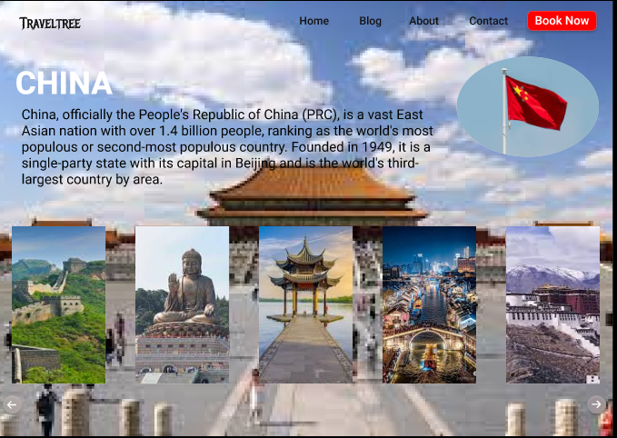
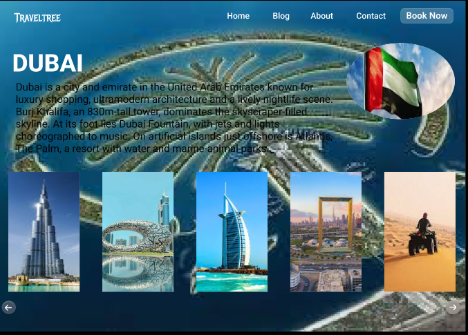
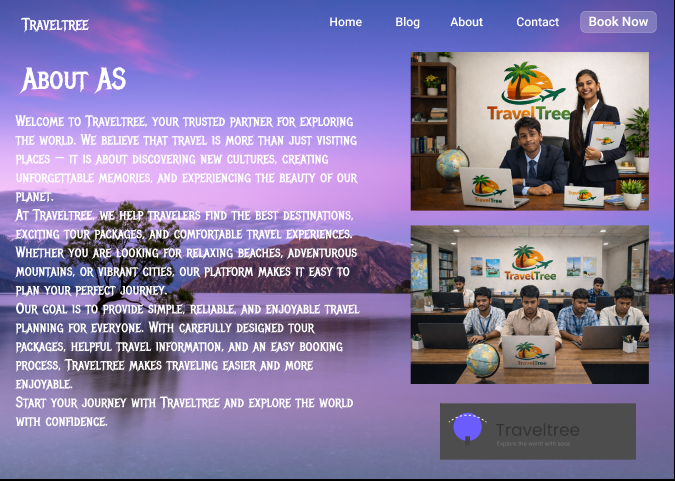

# TravelTree-UI-UX-Design
TravelTree – A modern travel website UI/UX design and interactive prototype created in Figma.
# 🌍 TravelTree – Travel Website UI/UX Design

TravelTree is a modern travel website UI/UX design created in Figma.
The project focuses on providing users with an easy and engaging
experience for discovering destinations and planning trips.

## 🎨 Project Type

UI/UX Design & Interactive Prototype

## 🛠️ Tools Used

- Figma
- Figma Prototype
- UI/UX Design
- Wireframing
- Prototyping

## ✨ Key Features

- Travel destination discovery
- Destination information
- Travel-focused navigation
- Attractive landing page
- User-friendly interface
- Interactive prototype
- Responsive design concept

## 📸 Design Preview

### Home Page

### Destinations

### Destination Details

### About Page

## 🔗 Figma Prototype

[View Interactive TravelTree Prototype](https://www.figma.com/proto/dTQQCkRXbOHikT9reE47sK/tour-website-design?node-id=0-1&t=KUzsURzN3lEpQ7GB-1)

## 🎯 Design Goals

- Create a clean and modern travel interface
- Make destination discovery simple
- Improve navigation and usability
- Provide an engaging visual experience
- Design an interface suitable for different screen sizes

## 👨‍💻 Designer

**Aravinth S**

UI/UX Designer | Web Developer
